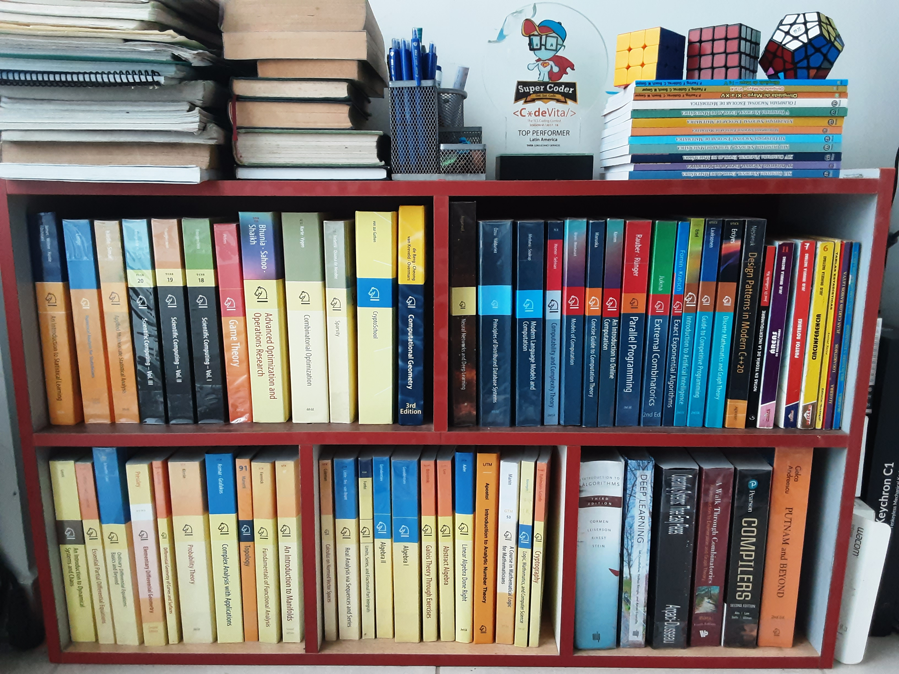

# Personal Knowledge Base

## [Mathematics](/docs/mathematics/mathematics.md)

### [Pure Mathematics](/docs/mathematics/pure-mathematics/pure-mathematics.md)

#### [Algebra & Algebraic Geometry](/docs/mathematics/pure-mathematics/algebra-and-algebraic-geometry/algebra-and-algebraic-geometry.md)
- [Linear Algebra](/docs/mathematics/pure-mathematics/algebra-and-algebraic-geometry/src/linear-algebra.md)
- [Multilineal Algebra](/docs/mathematics/pure-mathematics/algebra-and-algebraic-geometry/src/multilinear-algebra.md)
- [Groups and Rings](/docs/mathematics/pure-mathematics/algebra-and-algebraic-geometry/src/groups-and-rings.md)
- [Galois Theory](/docs/mathematics/pure-mathematics/algebra-and-algebraic-geometry/src/galois-theory.md)
- [Algebraic Topology](/docs/mathematics/pure-mathematics/algebra-and-algebraic-geometry/src/algebraic-topology.md)
- [Algebraic Geometry](/docs/mathematics/pure-mathematics/algebra-and-algebraic-geometry/src/algebraic-geometry.md)

#### [Analysis & PDEs](/docs/mathematics/pure-mathematics/analysis-and-pdes/analysis-and-pdes.md)
- [Precalculus](docs/mathematics/pure-mathematics/analysis-and-pdes/src/precalculus.md)
- [Differential Calculus](docs/mathematics/pure-mathematics/analysis-and-pdes/src/differential-calculus.md)
- [Integral Calculus](docs/mathematics/pure-mathematics/analysis-and-pdes/src/integral-calculus.md)
- [Multivariate Calculus](docs/mathematics/pure-mathematics/analysis-and-pdes/src/multivariate-calculus.md)
- [Applied Calculus](docs/mathematics/pure-mathematics/analysis-and-pdes/src/applied-calculus.md)
- [Real Analysis](docs/mathematics/pure-mathematics/analysis-and-pdes/src/real-analysis.md)
- [Topology in ℝn](docs/mathematics/pure-mathematics/analysis-and-pdes/src/topology-rn.md)
- [Analysis on Manifolds](docs/mathematics/pure-mathematics/analysis-and-pdes/src/analysis-on-manifolds.md)
- [Complex Analysis](docs/mathematics/pure-mathematics/analysis-and-pdes/src/complex-analysis.md)
- [Measure Theory](docs/mathematics/pure-mathematics/analysis-and-pdes/src/measure-theory.md)
- [Functional Analysis](docs/mathematics/pure-mathematics/analysis-and-pdes/src/functional-analysis.md)
- [General Topology](docs/mathematics/pure-mathematics/analysis-and-pdes/src/general-topology.md)
- [Applied Differential Equations](docs/mathematics/pure-mathematics/analysis-and-pdes/src/applied-differential-equations.md)
- [Ordinary Differential Equations](docs/mathematics/pure-mathematics/analysis-and-pdes/src/ordinary-differential-equations.md)
- [Partial Differential Equations](docs/mathematics/pure-mathematics/analysis-and-pdes/src/partial-differential-equations.md)

#### [Geometry](/docs/mathematics/pure-mathematics/geometry/geometry.md)
- [Differential Geometry](/docs/mathematics/pure-mathematics/geometry/src/differential-geometry.md)
- Riemmanian Geometry

#### [Mathematical Logic and Foundations](/docs/mathematics/pure-mathematics/mathematical-logic-and-foundations/mathematical-logic-and-foundations.md)
- [Mathematical Logic](/docs/mathematics/pure-mathematics/mathematical-logic-and-foundations/src/mathematical-logic.md)
- [Set Theory](/docs/mathematics/pure-mathematics/mathematical-logic-and-foundations/src/set-theory.md)

#### [Number Theory](/docs/mathematics/pure-mathematics/number-theory/number-theory.md)
- [Elementary Number Theory](/docs/mathematics/pure-mathematics/number-theory/src/elementary-number-theory.md)
- [Algebraic Number Theory](/docs/mathematics/pure-mathematics/number-theory/src/algebraic-number-theory.md)
- [Analytic Number Theory](/docs/mathematics/pure-mathematics/number-theory/src/analytic-number-theory.md)
- [Elliptic Curves](/docs/mathematics/pure-mathematics/number-theory/src/elliptic-curves.md)

#### [Probability & Statistics](/docs/mathematics/pure-mathematics/probability-and-statistics/probability-and-statistics.md)
- [Statistics](/docs/mathematics/pure-mathematics/probability-and-statistics/src/statistics.md)
- [Probability Theory](/docs/mathematics/pure-mathematics/probability-and-statistics/src/probability-theory.md)
- [Markov Chains](/docs/mathematics/pure-mathematics/probability-and-statistics/src/markov-chains.md)

### [Applied Mathematics](/docs/mathematics/applied-mathematics/applied-mathematics.md)

#### [Combinatorics](/docs/mathematics/applied-mathematics/combinatorics/combinatorics.md)
- [Combinatorial Analysis](/docs/mathematics/applied-mathematics/combinatorics/src/combinatorial-analysis.md)
- [Graph Theory](/docs/mathematics/applied-mathematics/combinatorics/src/graph-theory.md)
- [Extremal Combinatorics](/docs/mathematics/applied-mathematics/combinatorics/src/extremal-combinatorics.md)
- [Enumerative Combinatorics](/docs/mathematics/applied-mathematics/combinatorics/src/enumerative-combinatorics.md)
- [Discrete Geometry](/docs/mathematics/applied-mathematics/combinatorics/src/discrete-geometry.md)
- [Matroid Theory](/docs/mathematics/applied-mathematics/combinatorics/src/matroid-theory.md)
- [Combinatorial Optimization](/docs/mathematics/applied-mathematics/combinatorics/src/combinatorial-optimization.md)
- [Probabilistic Methods in Combinatorics](/docs/mathematics/applied-mathematics/combinatorics/src/probabilistic-methods-in-combinatorics.md)
- [Polynomial Method in Combinatorics](/docs/mathematics/applied-mathematics/combinatorics/src/polynomial-method-in-combinatorics.md)

#### [Computational Science & Numerical Analysis](/docs/mathematics/applied-mathematics/computational-science-and-numerical-analysis/computational-science-and-numerical-analysis.md)
- [Numerical Analysis](/docs/mathematics/applied-mathematics/computational-science-and-numerical-analysis/src/numerical-analysis.md)

#### [Operations Research](/docs/mathematics/applied-mathematics/operations-research/operations-research.md)
- [Linear Programming](/docs/mathematics/applied-mathematics/operations-research/src/linear-programming.md)
- [Convex Optimization](/docs/mathematics/applied-mathematics/operations-research/src/convex-optimization.md)

#### [Seminars](/docs/mathematics/applied-mathematics/seminars/seminars.md)
- [Advanced Topics in Random Structures](/docs/mathematics/applied-mathematics/seminars/src/advanced-topics-in-random-structures.md)

## [Computer Science](/docs/computer-science/computer-science.md)

### [Artificial Intelligence](/docs/computer-science/artificial-intelligence/artificial-intelligence.md)

#### [Machine Learning](/docs/computer-science/artificial-intelligence/machine-learning/machine-learning.md)
- [Introduction to Artificial Intelligence](/docs/computer-science/artificial-intelligence/machine-learning/src/introduction-to-artificial-intelligence.md)
- [Introduction to Machine Learning](/docs/computer-science/artificial-intelligence/machine-learning/src/introduction-to-machine-learning.md)
- [Optimization for Machine Learning](/docs/computer-science/artificial-intelligence/machine-learning/src/optimization-for-machine-learning.md)

#### [Deep Learning](/docs/computer-science/artificial-intelligence/deep-learning/deep-learning.md)
- [Introduction Deep Learning](/docs/computer-science/artificial-intelligence/deep-learning/src/introduction-to-deep-learning.md)
- [Deep Reinforcement Learning](/docs/computer-science/artificial-intelligence/deep-learning/src/deep-reinforcement-learning.md)
- [Neural Computation](/docs/computer-science/artificial-intelligence/deep-learning/src/neural-computation.md)

#### [Natural Language Processing](/docs/computer-science/artificial-intelligence/natural-language-processing/natural-language-processing.md)
- [Introduction to NLP](/docs/computer-science/artificial-intelligence/natural-language-processing/src/introduction-to-nlp.md)
- [Advanced NLP](/docs/computer-science/artificial-intelligence/natural-language-processing/src/advanced-nlp.md)

#### [Computer Vision](/docs/computer-science/artificial-intelligence/computer-vision/computer-vision.md)
- [Introduction to Computer Vision](/docs/computer-science/artificial-intelligence/computer-vision/src/introduction-to-computer-vision.md)

#### [Seminars](/docs/computer-science/artificial-intelligence/seminars/seminars.md)
- [Probabilistic Graphical Model](/docs/computer-science/artificial-intelligence/seminars/src/probabilistic-graphical-models.md)

### [Computer Systems](/docs/computer-science/computer-systems/computer-systems.md)

#### [Operating / Distributed Systems](/docs/computer-science/computer-systems/operating-and-distributed-systems/operating-and-distributed-systems.md)
- [Computer Systems Engineering](/docs/computer-science/computer-systems/operating-and-distributed-systems/src/computer-systems-engineering.md)
- [Operating Systems and Systems Programming](/docs/computer-science/computer-systems/operating-and-distributed-systems/src/operating-systems-and-systems-programming.md)
- [Advanced Operating Systems Structures and Implementation](/docs/computer-science/computer-systems/operating-and-distributed-systems/src/advanced-operating-systems-structures-and-implementation.md)
- [Distributed Systems](/docs/computer-science/computer-systems/operating-and-distributed-systems/src/distributed-systems.md)

#### [Architecture](/docs/computer-science/computer-systems/architecture/architecture.md)
- [Parallel Computer Architecture](/docs/computer-science/computer-systems/architecture/src/parallel-computer-architecture.md)

#### [Computer Security](/docs/computer-science/computer-systems/computer-security/computer-security.md)
- [Introduction to Computer Security](/docs/computer-science/computer-systems/computer-security/src/introduction-to-computer-security.md)

#### [Computer Networks](/docs/computer-science/computer-systems/computer-networks/computer-networks.md)
- [Introduction to Computer networks](/docs/computer-science/computer-systems/computer-networks/src/introduction-to-computer-networks.md)

#### [Databases](/docs/computer-science/computer-systems/databases/databases.md)
- [Introduction to Databases](/docs/computer-science/computer-systems/databases/src/introduction-to-databases.md)
- [Advanced Database Systems](/docs/computer-science/computer-systems/databases/src/advanced-database-systems.md)
- [Self-Driving Database Management System](/docs/computer-science/computer-systems/databases/src/self-driving-database-management-systems.md)
- [Multimedia Databases](/docs/computer-science/computer-systems/databases/src/multimedia-databases.md)
- [Data-Intensive Systems](/docs/computer-science/computer-systems/databases/src/data-intensive-systems.md)
- [Mining Massive Datasets](/docs/computer-science/computer-systems/databases/src/mining-massive-datasets.md)

### [Software Design and Engineering](/docs/computer-science/software-design-and-engineering/software-design-and-engineering.md)

#### [Programming Languages](/docs/computer-science/software-design-and-engineering/programming-languages/programming-languages.md)
- [Introduction to Programming](/docs/computer-science/software-design-and-engineering/programming-languages/src/introduction-to-programming.md)
- [Imperative Programming](/docs/computer-science/software-design-and-engineering/programming-languages/src/introduction-to-programming.md)
- [Functional Programming](/docs/computer-science/software-design-and-engineering/programming-languages/src/functional-programming.md)
- [Quantitative Program Analysis](/docs/computer-science/software-design-and-engineering/programming-languages/src/quantitative-program-analysis.md)
- [Programming Languages and Compilers](/docs/computer-science/software-design-and-engineering/programming-languages/src/programming-languages-and-compilers.md)

#### [Software](/docs/computer-science/software-design-and-engineering/software/software.md)
- [Software Construction](/docs/computer-science/software-design-and-engineering/software/src/software-construction.md)
- [Software Engineering](/docs/computer-science/software-design-and-engineering/software/src/software-engineering.md)
- [Software Engineering for Startups](/docs/computer-science/software-design-and-engineering/software/src/software-engineering-for-startups.md)
- [Software Engineering for Scientific Computing](/docs/computer-science/software-design-and-engineering/software/src/software-engineering-for-scientific-computing.md)
- [Data Science](/docs/computer-science/software-design-and-engineering/software/src/data-science.md)
- [Computer Graphics](/docs/computer-science/software-design-and-engineering/software/src/computer-graphics.md)
- [Human-Computer Interaction](/docs/computer-science/software-design-and-engineering/software/src/human-computer-interaction.md)

### [Theory](/docs/computer-science/theory/theory.md)

#### [Algorithms & Data Structures](/docs/computer-science/theory/algorithms-and-data-structures/algorithms-and-data-structures.md)
- [Introduction to Algorithms](/docs/computer-science/theory/algorithms-and-data-structures/src/introduction-to-algorithms.md)
- [Intermediate Algorithms](/docs/computer-science/theory/algorithms-and-data-structures/src/intermediate-algorithms.md)
- [Advanced Algorithms](/docs/computer-science/theory/algorithms-and-data-structures/src/advanced-algorithms.md)
- [Data Structures](/docs/computer-science/theory/algorithms-and-data-structures/src/data-structures.md)
- [Computational Geometry](/docs/computer-science/theory/algorithms-and-data-structures/src/computational-geometry.md)
- [Algorithmic Game Theory](/docs/computer-science/theory/algorithms-and-data-structures/src/algorithmic-game-theory.md)
- [Combinatorial Algorithms](/docs/computer-science/theory/algorithms-and-data-structures/src/combinatorial-algorithms.md)
- [Randomized Algorithms](/docs/computer-science/theory/algorithms-and-data-structures/src/randomized-algorithms.md)
- [Parallel and Concurrent Algorithms](/docs/computer-science/theory/algorithms-and-data-structures/src/parallel-and-concurrent-algorithms.md)

#### [Automata, Computability and Complexity](/docs/computer-science/theory/automata-computability-complexity/automata-computability-complexity.md)
- [Computation Theory](/docs/computer-science/theory/automata-computability-complexity/src/computation-theory.md)
- [Complexity Theory](/docs/computer-science/theory/automata-computability-complexity/src/complexity-theory.md)
- [Advanced Computational Complexity Theory](/docs/computer-science/theory/automata-computability-complexity/src/advanced-complexity-theory.md)

#### [Cryptography](/docs/computer-science/theory/cryptography/cryptography.md)
- [Introduction to Cryptography](/docs/computer-science/theory/cryptography/src/foundations-of-cryptography.md)

#### [Seminars](/docs/computer-science/theory/seminars/seminars.md)
- [Algorithms and Computational Complexity](/docs/computer-science/theory/seminars/src/algorithms-and-computational-complexity.md)
- [The Sum-of-Squares Algorithm](/docs/computer-science/theory/seminars/src/sum-of-squares-algorithm.md)
- [Hierarchies of Integer Programming Relaxations](/docs/computer-science/theory/seminars/src/hierarchies-of-integer-programming-relaxations.md)

## [Competitions](/docs/competitions/competitions.md)

- [IMO / IMC / Putnam](/docs/competitions/src/imo-imc-putnam.md)
- [IOI / ICPC](/docs/competitions/src/ioi-icpc.md)

## Software Engineering

### Languages & Frameworks
- C++
- Java
- JavaScript
- Python
    - Django
    - FastAPI
- R

### Databases
- Oracle
- PostgreSQL
- Redis

### DevOps
- AWS
- Docker

### Engineering Productivity
- Git
- Bash
- Crontabs
- tmux

### Editors
- Vim
- Jupyter notebook

## Links you might want to read
- [Learn](https://web.evanchen.cc/techspeech.html) [to](https://web.evanchen.cc/filesys.html) [Code](https://web.evanchen.cc/techsupport.html) - Evan Chen
- [Why LaTeX?](https://web.evanchen.cc/faq-latex.html) - Evan Chen
- [Why Unix?](https://web.evanchen.cc/faq-unix.html) - Evan Chen
- [Doing Theoretical Computer Science research](https://diderot-production.s3.amazonaws.com/media/courses_public/CMU%3APittsburgh%2C%20PA%3A15751%3ASpring%3A2019-20/book%3ALectures/ch%3Abook%3ALectures%3A%3A1cee4c5e-3718-11ea-b730-0e6bd3fbae45/chapter_attachments/9ef2297a-37a2-11ea-8641-0ae2204ab0dd_/tmp/tmpzkX74n/lecture01-2020.pdf) - Ryan O'Donnell
- [Giving clear talks](http://graphics.stanford.edu/~kayvonf/misc/cleartalktips.pdf) - Kayvon Fatahalian
- [If coding can be taught to someone without a college degree, what is the purpose of requiring a Bachelor’s degree for many coding jobs?](https://qr.ae/pvKNNa) - Tikhon Jelvis
- [What are the biggest misconceptions about Computer Science?](https://qr.ae/pvKNII) - Tikhon Jelvis
- [What programming projects have given you the most insight on a programming concept/technique?](https://qr.ae/pvKNG4) - Tikhon Jelvis
- [What do only people with 20-50 years of programming experience know?](https://qr.ae/pvKNIu) - Dave Voorhis
- [High School and College](https://web.evanchen.cc/faq-school.html) - Evan Chen
- [Math contests](https://web.evanchen.cc/faq-contest.html) - Evan Chen
- [What explains the Chinese domination at the IMO?](https://qr.ae/pvKI0V) - Zhaojun Zhang
- [How do Russians learn competitive coding?](https://qr.ae/pvKILm) - Egor Suvorov
- [Does practice mean everything for competitive programming, or do I have to have an Einstein brain?](https://qr.ae/pvKNRO) - Bohdan Pryshchenko
- [What made you quit competitive programming?](https://qr.ae/pvKNTq) - Sergey Kulik
- [Why do I hate studying despite being highly intelligent?](https://qr.ae/pvKNX2) - Steve Denton
- [Do most highly intelligent people get bored by routine learning in schools and hence cannot stand formal education?](https://qr.ae/pvKNRs) - Pieter Cortebeeck
- [Do the top 1% students mostly rely on their talents or hard work to sustain their positions?](https://qr.ae/pvKNRx) - Chier Hu
- [What piece of advice do you have for students to succeed academically and financially?](https://qr.ae/pvKN74) - Balaji Viswanathan
- [Why do some intelligent people lose all interest in academia?](https://qr.ae/pvKNRi) - Steven Thomason
- [What's it like to be close friends with a genius?](https://qr.ae/pvKN1w) - Joe Wezorek
- [Why do some people with a high IQ get depressed or have no friends?](https://qr.ae/pvKNRf) - Susanna Viljanen
- [Are people with higher IQ more likely to be depressed?](https://qr.ae/pvKNX3) - Simon Chatzigiannis
- [Do you find yourself to be a wasted talent? Do extremely intelligent people simply not care about what society deems as successful?](https://qr.ae/pvKNp6) - Susanna Viljanen
- [Why is it that intelligent people tend to feel lonely most of the time?](https://qr.ae/pvKNp3) - Susanna Viljanen
- [What is the brutal truth about people with low IQs?](https://qr.ae/pvKNTB) - Susanna Viljanen
- [What's it like to be genuinely apolitical?](https://qr.ae/pvKNT3) - Tikhon Jelvis

## Picture of my bedroom
